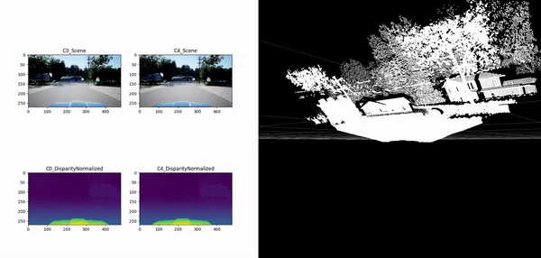
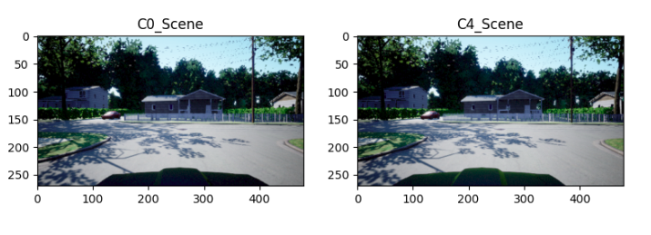
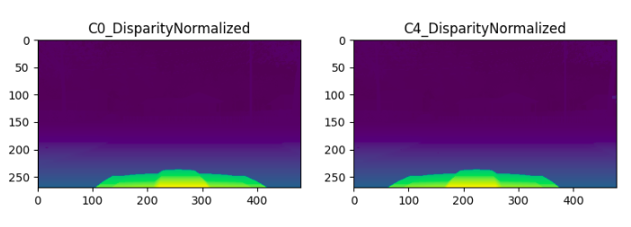

# Autopilot



# Generating ground truth data

The simulator sends in the following

## RGB Data


## Normalised Disparity Data


## Producing 3D point cloud
We are able to use `points = cv2.reprojectImageTo3D(depth_map, p_mat)` to generate the point cloud.
```python
p_mat = np.array([[-0.501202762, 0.000000000, 0.000000000, 0.000000000],
    [0.000000000, -0.501202762, 0.000000000, 0.000000000],
    [0.000000000, 0.000000000, 10.00000000, 100.00000000],
    [0.000000000, 0.000000000, -10.0000000, 0.000000000]
]) 
points = cv2.reprojectImageTo3D(depth_map, p_mat)
```


## Setting up Python env

The environment involes installing the headless version of OpenCV as the normal version causes PyQt5 to crash. This script creates a Virtual Env at `~/auto`
```bash
./setup_env.sh
source ~/auto/bin/activate
```

Generate `settings.stereo.json`
```bash
python generate_cameras.py > settings.stereo.json
```

## Launching the Project

The `main.py` will start the sim and the rendering software as multiple processes

```
python main.py
```

## Install PyTorch with CUDA

Refer to the official website for details

https://pytorch.org/get-started/locally/

```bash
pip3 install torch==1.9.1+cu111 torchvision==0.10.1+cu111 torchaudio==0.9.1 -f https://download.pytorch.org/whl/torch_stable.html
```

# Running the sim
```bash
~/Apps/AirSimNH_1.6.0/LinuxNoEditor/AirSimNH.sh -WINDOWED -ResX=640 -ResY=480 --settings /home/aditya/Autopilot/settings.stereo.json

/mnt/HDD/home/aditya/Airsim/AbandonedPark/LinuxNoEditor/AbandonedPark.sh -WINDOWED -ResX=640 -ResY=480 --settings /home/aditya/Autopilot/settings.stereo.json

/mnt/HDD/home/aditya/Airsim/Africa_Savannah/LinuxNoEditor/Africa_001.sh -WINDOWED -ResX=640 -ResY=480 --settings /home/aditya/Autopilot/settings.stereo.json

/mnt/HDD/home/aditya/Airsim/Building_99/LinuxNoEditor/Building_99.sh -WINDOWED -ResX=640 -ResY=480 --settings /home/aditya/Autopilot/settings.stereo.json

/mnt/HDD/home/aditya/Airsim/TrapCam/LinuxNoEditor/TrapCam.sh -WINDOWED -ResX=640 -ResY=480 --settings /home/aditya/Autopilot/settings.stereo.json

/mnt/HDD/home/aditya/Airsim/ZhangJiajie/LinuxNoEditor/ZhangJiajie.sh -WINDOWED -ResX=640 -ResY=480 --settings /home/aditya/Autopilot/settings.stereo.json

/mnt/HDD/home/aditya/Airsim/MSBuild2018/LinuxNoEditor/MSBuild2018.sh -WINDOWED -ResX=640 -ResY=480 --settings /home/aditya/Autopilot/settings.stereo.json

~/Apps/LandscapeMountains/LinuxNoEditor/LandscapeMountains.sh -WINDOWED -ResX=640 -ResY=480 --settings /home/aditya/Autopilot/settings.stereo.json
```